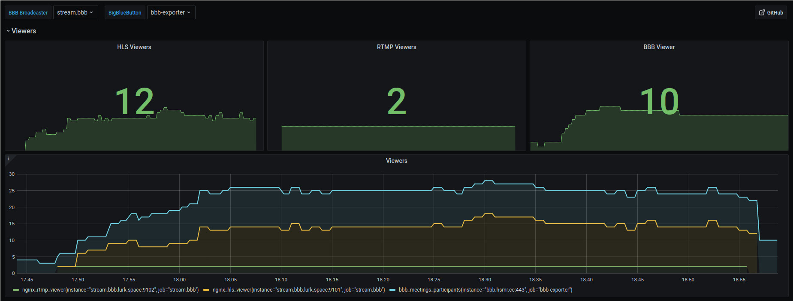

# BigBlueButton Broadcaster

Containerized setup to stream and record a BigBlueButton meeting to the web.
This includes recording, converting, a web server with valid TLS and monitoring.





## Install

This software was made to be deployed entirely with Docker Compose.
Thus, the installation is quite straightforward.

First, install both Docker and Docker Compose.
For Debian follow [this link for Docker](https://docs.docker.com/engine/install/debian/) and [this one for Docker Compose](https://docs.docker.com/compose/install/).

```sh
# Clone this repository including all its submodules
git clone --recurse-submodules https://github.com/oxzi/bbb-broadcaster.git
cd bbb-broadcaster

# Adjust the configuration, see below
cp .env{.template,}
vim .env

# Go for a test drive
docker-compose -f docker-compose.yml - docker-compose.dev.yml up --build

# Go live with valid HTTPS
docker-compose -f docker-compose.yml - docker-compose.prod.yml up --build
```


## Configuration

- `VIDEO_MNT` specifies where the recordings should be saved.
- `LETSENCRYPT_MNT` specifies where Let's Encrypt certificates should be saved.
- `ACME_EMAIL` is your email address, used for Let's Encrypt.
- `DOMAIN` is your domain for which your certificate will be created.
- `BBB_URL` is the API endpoint of your BBB instance, e.g., `https://bbb.hsmr.cc/bigbluebutton/api`.
- `BBB_SECRET` is your BBB API secret.
  You can fetch this by `bbb-conf --secret` on your BBB host.
- `BBB_MEETING_ID` is the BBB ID of the meeting you want to stream.
  This ID is **not** the Greenlight ID within the URL.
  However, when you are using the Greenlight frontend, you can query the meeting ID via SQL.
  ```
  user@bbb:/opt/greenlight$ sudo docker exec -it greenlight_db_1 bash

  bash-5.1# psql greenlight_production postgres

  greenlight_production=# SELECT bbb_id FROM rooms WHERE uid = 'general';
                    bbb_id
  ------------------------------------------
   trololololololololololololololololololol
  (1 row)
  ```
- `BBB_RESOLUTION` for the recording.
  Beware, large resolutions create huge files.


## Prometheus and Grafana

By default, three Prometheus exporters are exposed, each on its own port.

- Port 9100: official [Node Exporter](https://github.com/prometheus/node_exporter)
- Port 9101: custom RTMP viewer exporter
- Port 9102: custom HLS viewer exporter

For the two custom exporters a Grafana Dashboard is shipped as `grafana_dashboard.json`.


## On the shoulders of giants

All this is only possible thanks to the following software, those I unfortunately forgot and all their dependencies.

- <https://docs.bigbluebutton.org/>
- <https://github.com/aau-zid/BigBlueButton-liveStreaming>
- <https://github.com/alfg/docker-nginx-rtmp>
- <https://github.com/arut/nginx-rtmp-module>
- <https://github.com/avrahamcornfeld/Varela-Round-Hebrew>
- <https://github.com/prometheus/node_exporter>
- <https://github.com/traefik/traefik>
- <https://github.com/video-dev/hls.js/>
- <https://nginx.org/>
- <https://www.ffmpeg.org/>
